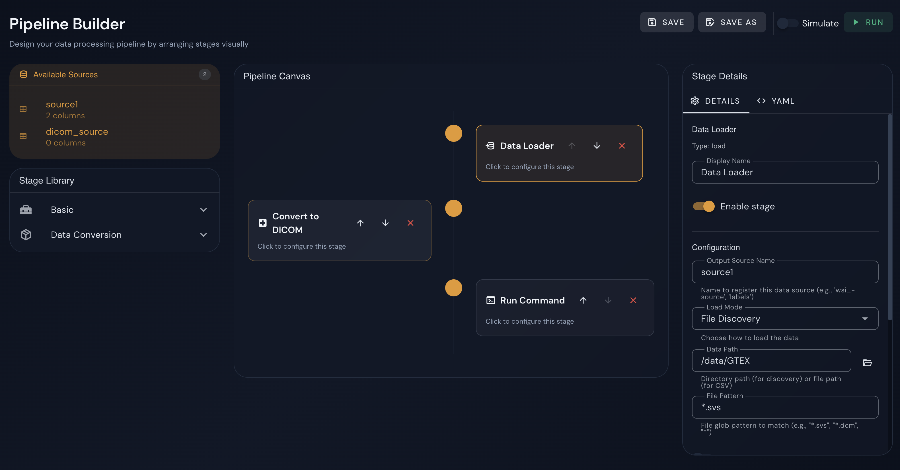

# Data Preparation Service 1st DEP Release

The DPS (Data Preparation for Exploitation) service transforms heterogeneous RI datasets into standardised formats required by downstream algorithms on the DEP. It is exposed through three interfaces: a REST API, a command-line interface (CLI), and a graphical web-based Pipeline Builder.

This document covers the first DEP release of the DPS, comprising three tasks:

- **DEP Release ID 6** — Design the manifest schema, REST API, CLI, and web-based Pipeline Builder interface.
- **DEP Release ID 7** — Reference modality: the Whole Slide Image (WSI) input format, the WSI → DICOM conversion pipeline, and a complete annotated example manifest.
- **DEP Release ID 8** — Containerisation: Apptainer packaging, HPC/SLURM integration, environment configuration, and provenance logging.


## DEP Release ID 6 — Design DPS API, CLI, and Manifest Schema


### Manifest Schema

The pipeline is fully described by a YAML manifest file. All three interfaces consume or produce manifests in the same schema.

#### Top-level structure

```yaml
manifest_id: "id2025-11-13"          # Unique identifier for this manifest version
created_by: "user@example.org"       # Author (username or email)
created_at: "2025-11-13T10:00:00Z"  # ISO 8601 creation timestamp
simulated: true                       # true = dry-run (no real commands executed)
                                      # false = production execution

job_steps:                            # Ordered list of pipeline steps
  - ...
```

#### Step types

Three step types are currently implemented:


##### `load` — Import data into a named source

```yaml
- step_name: Load WSI files
  type: load
  enabled: true
  params:
    output_source_name: wsi_source    # Name to register this source for downstream steps
    mode: discovery                    # "discovery" | "csv_file"
    path: /data/GTEX                  # Directory (discovery) or file path (csv_file)
    include: "*.svs"                  # Glob pattern for file matching (discovery mode)
    recursive: false                  # Search subdirectories
    directory_mode: false             # Treat directories as items instead of files
    file_type: default                # "default" | "wsi" (lazy WSI patch loader)
    columns:
      # discovery mode
      column_name: svs_path                          # Column to store the full file path
      filename_to_columnname: "^(?P<slide_id>.+?)(?=\\.svs$)"  # Regex with named groups
                                                     #   → each group becomes a column
      # csv_file mode
      header: true                    # Whether the CSV has a header row
      delimiter: ","
```

The `filename_to_columnname` regex uses Python named capture groups (`?P<name>`). Each group name becomes a column in the data source. Example:

| Filename | `slide_id` (extracted) | `svs_path` (full path) |
|---|---|---|
| `GTEX-1117F-0126.svs` | `GTEX-1117F-0126` | `/data/GTEX/GTEX-1117F-0126.svs` |

##### `custom_command` — Execute a shell command

```yaml
- step_name: Convert to DICOM
  type: custom_command
  enabled: true
  params:
    input_source_name: wsi_source     # Source to iterate (per_row mode)
    execution_mode: per_row           # "once" | "per_row"
    command: "wsidicomizer -i {svs_path} -o /data/output/{slide_id}"
    # Placeholders {column_name} are substituted per row from input_source
```

In `per_row` mode every row of the input source is processed independently. Placeholder names must match column names in the input source. In `once` mode the command runs a single time with no substitution.


##### `join` — Merge two named sources

The `join` step merges two previously registered sources into a new combined source by matching rows on a key column. It is the primary mechanism for correlating file path tables with metadata: for example, pairing a table of discovered SVS paths (produced by a `load` step) with a labels CSV so that every downstream row carries both the file path and its corresponding annotation. The output source contains all columns from both inputs; when the key columns have different names, both are retained in the result.

Four join types are supported, matching standard SQL semantics:

| `join_type` | Rows in output |
|-------------|----------------|
| `inner` | Only rows that have a matching key on both sides |
| `left` | All rows from the left source; right columns are `null` where there is no match |
| `right` | All rows from the right source; left columns are `null` where there is no match |
| `outer` | All rows from both sources; unmatched columns are `null` |

`missing_policy: drop` post-processes the merged result by removing any row that contains a `null` value — i.e. any row where one side had no matching key. Combined with a `left`, `right`, or `outer` join this produces the same effective result as `inner` while making the intent explicit. It has no effect on an `inner` join since unmatched rows are never included.

```yaml
- step_name: Join WSI with labels
  type: join
  enabled: true
  params:
    left_source_name: wsi_source
    right_source_name: labels_source
    output_source_name: merged
    left_key: slide_id
    right_key: slide_id
    join_type: inner                  # "inner" | "left" | "right" | "outer"
    missing_policy: drop              # Unmatched rows are dropped
```


#### Complete manifest example

For a complete annotated manifest, see **[DEP Release ID 7 — Reference Modality Manifest: Whole Slide Images (WSI)](#dep-release-id-7--reference-modality-manifest-whole-slide-images-wsi)**.

---

### REST API

The DPS backend is a FastAPI application running on port `8000`. All pipeline endpoints are prefixed with `/pipeline/`.

#### Health

| Method | Endpoint | Description |
|--------|----------|-------------|
| `GET` | `/health` | Returns `{"status": "ok"}` |

#### Pipeline management

| Method | Endpoint | Description |
|--------|----------|-------------|
| `POST` | `/pipeline/save` | Save a new pipeline manifest for a project |
| `PUT` | `/pipeline/save` | Update (overwrite) an existing pipeline |
| `GET` | `/pipeline/list?project_id=<id>` | List all saved pipelines for a project |
| `GET` | `/pipeline/load?project_id=<id>&pipeline_id=<id>` | Load a pipeline manifest |
| `DELETE` | `/pipeline/<project_id>/<pipeline_id>` | Delete a pipeline |
| `POST` | `/pipeline/source-columns` | Introspect column names from a manifest's load steps |

#### Direct pipeline execution

| Method | Endpoint | Description |
|--------|----------|-------------|
| `POST` | `/pipeline/run` | Start a pipeline run in the background, returns `run_id` |
| `GET` | `/pipeline/run/<run_id>` | Poll run status and retrieve streamed logs |
| `POST` | `/pipeline/run/<run_id>/cancel` | Request cooperative cancellation |
| `GET` | `/pipeline/runs?project_id=<id>` | List all runs (without log content) |

**POST `/pipeline/run` request body:**

```json
{
  "manifest": { "manifest_id": "...", "job_steps": [ ... ] },
  "simulated": false,
  "pipeline_id": "svs_to_dicom_abc123.yaml",
  "pipeline_name": "SVS to DICOM",
  "project_id": "proj-uc7-001"
}
```

**GET `/pipeline/run/<run_id>` response:**

```json
{
  "status": "success",
  "run": {
    "run_id": "run-a1b2c3d4",
    "status": "completed",
    "pipeline_name": "SVS to DICOM",
    "simulated": false,
    "created_at": "2025-11-13T10:00:00",
    "started_at": "2025-11-13T10:00:01",
    "completed_at": "2025-11-13T10:45:22",
    "runtime": "45m 21s",
    "logs": "[2025-11-13 10:00:01] INFO - Starting pipeline run (production)\n..."
  }
}
```

Run status lifecycle: `starting` → `running` → `cancelling` → `completed` | `failed` | `cancelled`

---

### CLI

The DPS service can be invoked directly as a Python script without the web server:

```bash
cd backend/app/services/dps_service

# Run a pipeline from a manifest file
python dps_service.py -m /path/to/manifest.yaml

# Run with verbose logging
python dps_service.py -m /path/to/manifest.yaml -v

# Run the bundled example (SVS → DICOM with join)
python dps_service.py -m example_manifest.yaml -v
```

| Flag | Description |
|------|-------------|
| `-m`, `--manifest` | Path to the YAML manifest file (required) |
| `-v`, `--verbose` | Enable INFO-level logging to stdout |
| `-s`, `--simulated` | Override the manifest `simulated` flag: force dry-run mode without editing the manifest |

The CLI respects the `simulated` flag in the manifest. Pass `-s` on the command line to force dry-run mode without editing the manifest file.

---

### Web Interface — Pipeline Builder

The Pipeline Builder (`/pipeline-builder`) provides a graphical interface for constructing, editing, and executing pipelines without writing YAML manually.

**Key features:**

- **Stage Library** (left panel): drag `Data Loader`, `Run Command`, `Join`, or composite `Convert to DICOM` chains onto the canvas.
- **Pipeline Canvas** (centre): visual ordered timeline of stages; reorder with ↑/↓ arrows.
- **Stage Details** (right panel): form-based configuration per stage. File fields open a filesystem browser rooted at `$DATA_DIR`.
- **YAML tab**: live editable YAML view, bi-directionally synced with the canvas.
- **Simulate toggle**: when enabled, commands are logged but not executed (dry-run).
- **Run / Stop**: starts a background execution; output appears in a live log drawer at the bottom of the screen.
- **Save / Save As**: persists the manifest to the project's manifest directory.
- **Navigation guard**: warns before leaving the page if a run is active; the run continues in the background and is visible on the DPS Pipelines page.

The DPS Pipelines page (`/dps-pipelines`) lists all saved pipelines and a **Recent Runs** table showing status, mode (simulated/production), start time, and runtime. Run logs can be viewed in a dialog.




*Figure 1: The DPS Pipeline Builder web interface showing the stage library (left), pipeline canvas (center), and stage configuration panel (right).*


## DEP Release ID 7 — Reference Modality Manifest: Whole Slide Images (WSI)

### Reference modality

The reference modality for UC7 (Colorectal Cancer Prediction) and UC8 (Synthetic Data Generation) is **Whole Slide Imaging (WSI)** — gigapixel digital pathology slides produced by slide scanners.

### Accepted input formats

| Format | Extension | Scanner vendor | Source library |
|--------|-----------|---------------|----------------|
| Aperio SVS | `.svs` | Aperio/Leica | `opentile`, `openslide` |
| Hamamatsu NDPI | `.ndpi` | Hamamatsu | `opentile` |
| Generic tiled TIFF | `.tiff`, `.tif` | Various | `opentile`, `tiffslide` |
| CZI | `.czi` | Zeiss | `czi` |
| iSyntax | `.isyntax` | Philips | `isyntax` |
| BioFormats-supported | various | Various | `bioformats` |

In the following, we will describe a Dicom conversion with the DPS service, using images from the GTEX dataset.

### Source directory layout

```
/data/<dataset>/
├── GTEX-1117F-0126.svs
├── GTEX-1117F-0226.svs
├── GTEX-1117F-0326.svs
└── ...
```

The manifest `load` step discovers files via glob and extracts structured metadata from filenames using a regex. For GTEX SVS files the recommended regex is:

```
^(?P<slide_id>.+?)(?=\.svs$)
```

This strips the `.svs` extension so `slide_id` contains only the bare identifier (e.g. `GTEX-1117F-0126`), which is then used as the DICOM output directory name.

### WSI → DICOM manifest

```yaml
manifest_id: "wsi-to-dicom-2025-11-13"
created_by: "user@example.org"
created_at: "2025-11-13T10:00:00Z"
simulated: false                        # set to true for a dry-run

job_steps:

  # 1 — Discover all SVS files; extract slide_id from the filename
  - step_name: Load WSI files
    type: load
    enabled: true
    params:
      output_source_name: source1
      mode: discovery
      path: /data/GTEX
      include: "*.svs"
      recursive: false
      directory_mode: false
      columns:
        column_name: svs_path
        filename_to_columnname: "^(?P<slide_id>.+?)(?=\\.svs$)"

  # 2 — Remove any previous conversion output
  - step_name: Clean DICOM output dir
    type: custom_command
    enabled: true
    params:
      execution_mode: once
      command: "rm -rf /data/output/dicom"

  # 3 — Re-create output directory
  - step_name: Create DICOM output dir
    type: custom_command
    enabled: true
    params:
      execution_mode: once
      command: "mkdir -p /data/output/dicom"

  # 4 — Convert each SVS file to DICOM (one subprocess per row)
  - step_name: Convert WSI to DICOM
    type: custom_command
    enabled: true
    params:
      input_source_name: source1
      execution_mode: per_row
      command: "wsidicomizer -i {svs_path} -o /data/output/dicom/{slide_id} --source opentile --format jpeg --quality 90"
```

`--source` auto-detection: omitting `--source` lets wsidicomizer choose the best library for the input format. For SVS, `opentile` is the default.

### DICOM output structure

Each converted slide produces a directory of DICOM part-10 files:

```
/data/output/dicom/
└── GTEX-1117F-0126/
    ├── 1.2.826.0.1.3680043.8.498.xxxxx.dcm   # Base resolution level
    ├── 1.2.826.0.1.3680043.8.498.yyyyy.dcm   # Pyramid level 1
    ├── 1.2.826.0.1.3680043.8.498.zzzzz.dcm   # Pyramid level 2
    └── ...
```

Files are named using **DICOM SOP Instance UIDs** — globally unique identifiers required by the DICOM standard. The number of files corresponds to the number of pyramid levels in the source WSI. DICOM viewers and PACS systems (Orthanc, 3D Slicer, OsiriX) use the UIDs embedded in the file metadata, not the filename.

### Metadata

wsidicomizer extracts the following metadata automatically from the source file where available:

- Pixel spacing / physical pixel size (µm/px)
- Objective power and magnification
- Scanner manufacturer and model
- Acquisition date/time
- Specimen label image (embedded in SVS)

Additional or overriding metadata can be supplied via `--metadata <json_file>` and `--default-metadata <json_file>`.

## DEP Release ID 8 — Containerized DPS with Provenance Logging

The DPS service is packaged as an **Apptainer** (formerly Singularity) container.

Container definition: `Apptainer.def`
Helper script: `apptainer.sh`

### Building the container

```bash
# Build (requires root or fakeroot)
sudo apptainer build ri-scale-dashboard.sif Apptainer.def

# Or using the helper script (auto-detects sudo / fakeroot)
./apptainer.sh build
```

The build installs:
- Python 3.11 with all backend dependencies (`fastapi`, `uvicorn`, `wsidicomizer`, `openslide-python`, `pandas`, `pyyaml`, …)
- Node.js 20 for the frontend
- System libraries: `openslide-tools`, `libvips`, `libopenjp2`, JPEG/TIFF libs

---

### Running the container

#### Start both services (recommended)

```bash
./apptainer.sh start
# Backend:  http://0.0.0.0:8000
# Frontend: http://localhost:5173
```

#### Backend only

```bash
./apptainer.sh backend
# or directly:
apptainer run ri-scale-dashboard.sif
```

#### Frontend only

```bash
./apptainer.sh frontend
# or directly:
apptainer exec --writable-tmpfs ri-scale-dashboard.sif \
    sh -c "cd /opt/ri-scale/frontend && npm run dev"
```

#### Run a DPS pipeline directly (without the web server)

```bash
# Using helper script with bundled example manifest
./apptainer.sh dps-pipeline

# Using a custom manifest
apptainer exec ri-scale-dashboard.sif \
    python /opt/ri-scale/backend/app/services/dps_service/dps_service.py \
    -m /path/to/manifest.yaml -v
```

#### With data directory binding

On HPC systems the data lives outside the container. Bind-mount it at runtime:

```bash
apptainer exec \
    --bind /scratch/datasets/GTEX:/data/GTEX \
    --bind /scratch/output:/data/output \
    ri-scale-dashboard.sif \
    python /opt/ri-scale/backend/app/services/dps_service/dps_service.py \
    -m /path/to/manifest.yaml -v
```

---

### Example SLURM job on MUSICA

```bash
#!/bin/bash
#SBATCH --job-name=dps-wsi-conversion
#SBATCH --ntasks=1
#SBATCH --cpus-per-task=8
#SBATCH --mem=32G
#SBATCH --time=08:00:00

apptainer exec \
    --bind /scratch/GTEX:/data/GTEX \
    --bind /scratch/output:/data/output \
    /path/to/ri-scale-dashboard.sif \
    python /opt/ri-scale/backend/app/services/dps_service/dps_service.py \
    -m /path/to/svs_to_dicom_manifest.yaml -v
```


## Provenance logging

Every pipeline run initiated through the web interface or REST API is recorded with full provenance.

#### What is recorded

Each run entry captures:

| Field | Description |
|-------|-------------|
| `run_id` | Unique identifier (e.g. `run-a1b2c3d4ef5g`) |
| `pipeline_id` | Manifest file ID |
| `pipeline_name` | Human-readable pipeline name |
| `project_id` | Associated project |
| `simulated` | Whether commands were actually executed |
| `created_at` | ISO timestamp when the run was submitted |
| `started_at` | ISO timestamp when execution began |
| `completed_at` | ISO timestamp when execution ended |
| `runtime` | Human-readable duration (e.g. `45m 21s`) |
| `status` | `starting` → `running` → `completed` \| `failed` \| `cancelled` |
| `logs` | Full timestamped stdout/stderr output from all pipeline steps |
| `manifest` | Snapshot of the manifest that was executed |

#### Persistence

Run records are persisted to disk at `backend/app/.runs_store.json` and survive backend restarts. The full log content is stored per run.

#### Accessing provenance records

**Via API:**

```bash
# List all runs for a project
curl "http://localhost:8000/pipeline/runs?project_id=proj-uc7-001"

# Get full provenance record including logs for a specific run
curl "http://localhost:8000/pipeline/run/run-a1b2c3d4"
```

**Via web interface:** DPS Pipelines page → Recent Runs table → click the log icon for any run.

#### Cancellation

Running pipelines check a cancellation event cooperatively between steps and between rows within a `custom_command` step. On cancellation:
1. The current row's subprocess receives `SIGTERM` (5-second grace period, then `SIGKILL`).
2. The run status is set to `cancelling` then `cancelled`.
3. The cancellation is recorded in the provenance log with timestamp.

```bash
# Cancel via API
curl -X POST "http://localhost:8000/pipeline/run/run-a1b2c3d4/cancel"
```
